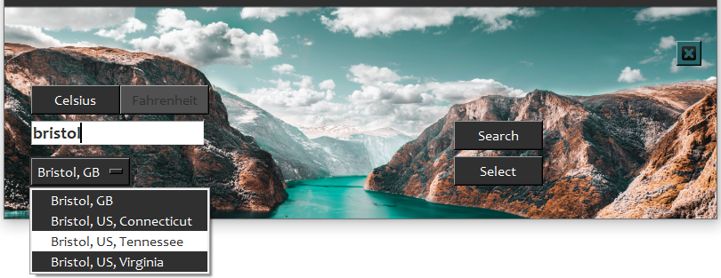

# Tempy 
- Weather forecast app using [OpenWeather API](https://openweathermap.org/)
<br>
<div align="center">
     
</div>
<br>
<br>
<div align="center">
     
</div>
<br>
<div align="center">
     
</div>

# Requirements
## Python and Modules
### Install packages\dependencies
```
pip install -r requirements.txt
```
### Separately
### Python 3 - used: 3.11
- https://www.python.org/

### Requests
- https://pypi.org/project/requests/

### Pillow
- https://pypi.org/project/Pillow/

## Others
### OpenWeather API API key
- Register and get an API key at [OpenWeather API](https://openweathermap.org/)
- It is 100% FREE till 60 calls/minute - 1,000,000 calls/month
- Save the `API key` in the `api_key.txt` file

### OS
- `Windows` (tested on 10)

# Guide
- Start the app
- It automatically loads the latest current and 5 days forecast information for the latest used location
- Click on the `Settings-cog` button for
    - Display the `Settings window`
    - Change the units of measurement (Celsius-Kmph / Fahrenheit-Mph)
    - Add new location/city
        - Restart is required for the new location’s weather information

# Modules used, which are part of Python 3.11
- datetime
- json
- os
- pathlib
- platform
- sys
- tkinter

## Thank you all who worked on the modules listed in this document!
## Thank you for the OpenWeather team!